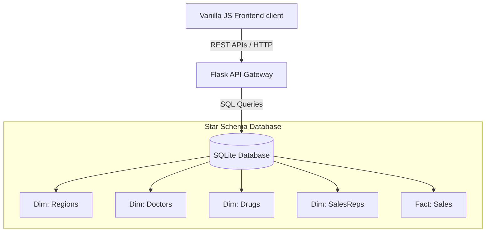
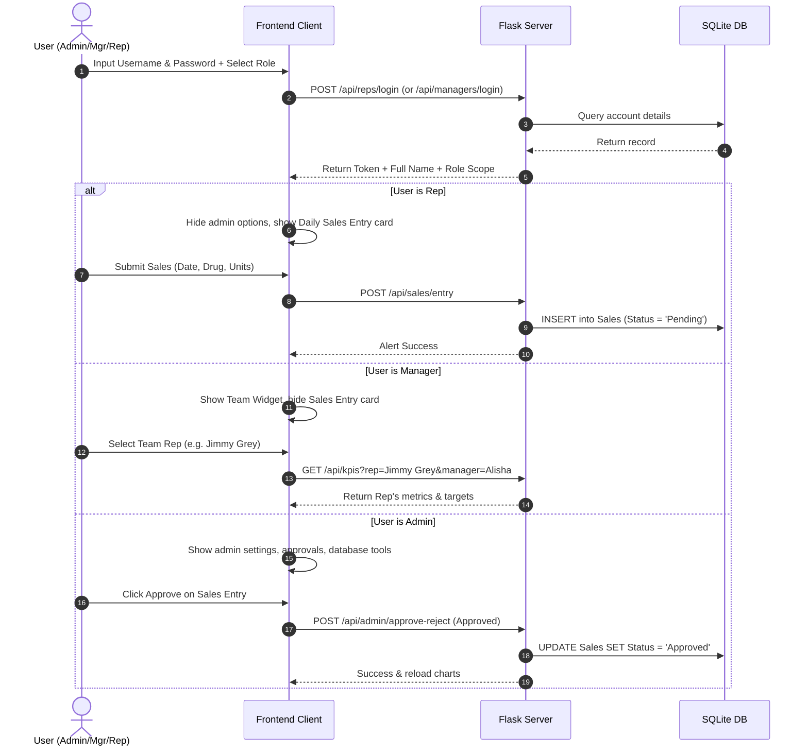

# Project Report - PharmaLytics Enterprise Analytics Platform

---

## 🧬 Name of the Project
**PharmaLytics** (formerly PharmaDna) — A secure, role-based pharmaceutical data operations, customer relations management (CRM), and performance analytics platform.

---

## 🎯 Mission
To empower pharmaceutical sales organizations with real-time data transparency, structured hierarchical oversight, and secure transactional pipelines. PharmaLytics bridges the gap between field representatives, district managers, and corporate administrators by converting raw transaction logs into high-fidelity actionable intelligence.

---

## 👁️ Vision
To establish a premium, zero-trust standard for pharmaceutical sales operations, facilitating seamless global-to-local target tracking, validation checkpoints, and forecasting pipelines that drive commercial excellence.

---

## 💡 What was the Need to Create This Project?
Prior to PharmaLytics, pharmaceutical companies faced significant operational challenges:
1. **Disconnected Field Reporting**: Reps lacked a direct, validated channel to submit daily unit sales, leading to delayed or inaccurate reporting.
2. **Lack of District Level Governance**: District managers could not efficiently track reps reporting under their territory or allocate performance targets locally.
3. **Data Integrity & Fraud Risks**: Direct database edits bypass approval gates. Admin approval workflows were required to review sales submissions before aggregating metrics.
4. **Poor Target Tracking**: Organizations struggled to bridge global corporate goals with representative targets, resulting in target misallocations.
5. **No Unified Analytical Interface**: Teams relied on manual spreadsheets instead of responsive analytics to run forecasting and doctor metrics.

---

## 🛠️ Technologies Used

### Frontend
- **HTML5 (Semantic)**: Provides the page structure. Used to implement clean, SEO-optimized, accessible structural hierarchy.
- **Vanilla CSS (Custom Variables & Flexbox/Grid)**: Provides a premium look without heavy dependencies (e.g. Tailwind). Implements custom variables (colors, spacing), light/dark themes, sidebar collapse animations, and responsive grids.
- **JavaScript (Vanilla ES6)**: Orchestrates routing, visual state toggle, dashboard filtering, notification center, form submissions, and Chart.js rendering.
- **Chart.js**: Implements fast, responsive, animated data dashboards (Line, Bar, Doughnut, and Radar charts) with support for dark/light themes.
- **Phosphor Icons**: Provides clean icons designed for a medical/scientific data look.
- **html2canvas & jsPDF**: Enables clients to capture the DOM dashboard view and export high-fidelity PDF statistics reports locally.

### Backend
- **Python (Flask)**: A lightweight WSGI web framework chosen for its flexibility, enabling rapid REST API development, routing, database connectivity, and cross-origin headers management.
- **SQLite3**: A serverless, local SQL engine storing regions, doctors, drugs, managers, sales representatives, and sales transaction logs.
- **Flask-CORS (Manual Header Hook)**: Manages cross-origin resource sharing, securing communication between local files and the backend services.

---

## 📐 Architecture
PharmaLytics is built on a **Client-Server Star Schema** design.

---

## 🔄 Workflow

PharmaLytics maintains three distinct workflow pipelines depending on the logged-in role:

### 1. Login Authentication & Session Initialization
- Users select their role (**System Administrator**, **District Sales Manager**, or **Representative**) and enter credentials.
- The system checks database records and returns the user's mapped full name, initials, and roles.
- The frontend stores session attributes (`isLoggedIn`, `userRole`, `repName` or `managerName`) and applies specific workspace views.

### 2. Representative Workspace Workflow
- **Avatar**: Displays the Representative's full name (e.g., `Jimmy Grey`) and initials (`JG`).
- **Dashboard Views**: Shows "My Revenue", "My Units Sold", "My Rank" (ranked against other reps), and "Target Achieved" (achievement percentage).
- **Daily Unit Entry**: Reps can enter today's unit sales by selecting the date, country (Germany or Poland), drug, and quantity. The system automatically calculates estimated revenue.
- **Approval Queue**: Submissions are entered with a `Pending` status. Reps cannot directly alter database numbers; they must wait for Admin approval.
- **Targets page**: Displays Company Goal, Manager's Goal, and Representative's Goal.

### 3. District Sales Manager Workspace Workflow
- **Avatar**: Displays the Manager's full name (e.g., `Alisha Cordwell`) and initials (`AC`).
- **Team Selection**: Shows a team widget displaying representatives under their management. Clicking on a representative filters the KPIs, forecasting, and doctor charts to that rep.
- **Targets page**: Shows Company Goal, Manager's own target, and Representative's target card. Managers have the authority to create/edit/delete targets for representatives under their team.

### 4. System Administrator Workspace Workflow
- **Avatar**: Displays **Shubhajit Ghosh** (`SG`).
- **Approvals Panel**: Shows sales submissions needing approval. Administrators can approve or reject entries.
- **Targets page**: Shows Company Goal and Manager Goals. Administrators can assign targets to managers but cannot see individual rep goals.
- **Database Tools**: Allows database management (seeding, clearing, adding new representatives or drugs).

---

## 🗄️ Files and Function-Level Dependency Analysis

Below is a detailed breakdown of all files and their function dependencies.

---

### 🌐 Frontend Files

#### 1. [index.html](file:///home/shubhajit/Desktop/proc%20dna%20project/index.html)
Defines the visual structure of the application, including the sidebar menu, role-specific content blocks, targets configurator, database management tables, and custom modal windows.
* **If it was not there what could have happened?** 
  The application would have no visual elements, tables, forms, or navigation tabs, making it impossible for users to interact with the software.

---

#### 2. [styles.css](file:///home/shubhajit/Desktop/proc%20dna%20project/styles.css)
Declares design styles, layout systems, light/dark themes, responsive grids, and animation variables.
* **If it was not there what could have happened?**
  The interface would fall back to default browser black-and-white layouts. Sidebar transitions, card shadows, theme colors, and flex grid alignment would be lost.

---

#### 3. [app.js](file:///home/shubhajit/Desktop/proc%20dna%20project/app.js)
Coordinates all client-side logic, routing, event listeners, data fetching, and Chart.js renderings.

##### Frontend Javascript Functions

| Line | Function | Purpose | Critical Dependency (If not there, what would happen?) |
|---|---|---|---|
| 4 | `resolveChartDefaults()` | Configures default styles for Chart.js (fonts, grid colors). | Charts would render with generic browser styles, ignoring active dark/light mode styles. |
| 33 | `formatCurrency(value)` | Converts numbers into currency values (e.g., `$1.20M` or `$150.00K`). | Metrics would display as raw unreadable numbers (e.g., `1200000.5`), cluttering the UI. |
| 48 | `safeFetch(url)` | Wraps fetch calls in try-catch blocks and returns JSON payload. | Unhandled network errors would crash page loading, making error tracking difficult. |
| 64 | `getFilterParams()` | Gathers active UI filters (country, year, rep, drug, manager) as query params. | Filtering options (e.g. clicking a team member) would not pass parameters to the API, causing charts to show unfiltered data. |
| 82 | `updateToggleBtnUI(theme)` | Updates the active theme toggle icon buttons (light/dark icons). | Theme icons would mismatch the selected display color mode. |
| 100 | `initSettings()` | Initializes setting page handlers (theme toggles, text resizing controls). | Users could not change visual settings (fonts, light/dark mode). |
| 150 | `getChartColor(varName)` | Fetches CSS color variables dynamically for chart drawing. | Charts would fail to match the custom indigo, teal, or amber color theme. |
| 154 | `applyThemeToChart(chart)` | Re-renders charts using theme colors on theme change. | Toggling dark mode would keep charts styled in light mode, causing contrast issues. |
| 174 | `refreshChartTheme()` | Loops through active charts and triggers theme updates. | Toggling dark mode would leave charts in their previous styling states. |
| 190 | `initNavigation()` | Binds click listeners to sidebar links to show/hide specific cards. | The application would not navigate between pages, sticking only to the dashboard. |
| 285 | `reloadActivePage()` | Refreshes data on the currently active tab. | Switching tabs would display outdated metrics, forcing manual page reloads. |
| 303 | `fetchStitchedRevenue(params)` | Fetches actual sales and appends forecasted lines. | The revenue forecasting line chart would not load. |
| 329 | `renderInlineError(...)` | Renders placeholder text inside cards on fetch failure. | Failed cards would remain empty or show "Loading..." indefinitely on network failure. |
| 342 | `loadDashboardData()` | Fetches core metrics and draws charts (Revenue, Units, Top Drugs, Region Performance). | The main dashboard dashboard would display static mock data. |
| 714 | `loadAnalyticsData()` | Loads raw sales data grid on the analytics tab. | The analytics grid tab would display an empty table. |
| 804 | `loadRepsData()` | Fetches representative directories for admin panels. | The admin representative list table would remain empty. |
| 828 | `loadDrugsData()` | Fetches drug lists for admin panels. | The admin drug catalogue list would remain empty. |
| 852 | `populateFilters()` | Populates filters (country, year, reps, drugs) dynamically from database. | Dropdown filters would remain empty, blocking custom report generation. |
| 887 | `initDatabaseManagement()` | Sets up forms to add representatives or drugs. | Admins could not add reps or drugs. |
| 975 | `initSidebarCollapse()` | Binds sidebar toggle buttons for responsive collapse. | The sidebar could not fold, leaving smaller screen layouts cramped. |
| 1007 | `validatePasswordConstraints(pwd)` | Enforces password constraints (numbers, upper/lower case, special characters). | Weak credentials could be set during account creation, risking database security. |
| 1017 | `updateRequirementUI(...)` | Updates visual checklist badges for password constraints. | Users would get no visual feedback on password validation. |
| 1033 | `checkSelectedRepPasswordStatus(...)` | Checks if a rep password needs modification. | Representatives with default passwords would not be prompted to set a secure password on login. |
| 1049 | `handleStandardPasswordInput()` | Evaluates password input and calls requirements checkers. | Password requirements UI would not update in real-time. |
| 1059 | `initLogin()` | Binds login submission and authentication checks. | Users could not log in to their respective workspaces. |
| 1198 | `completeRepresentativeLogin(rep)` | Initializes sessions for logged-in representatives. | Reps would be redirected to the admin page or locked out of their sales forms. |
| 1226 | `completeManagerLogin(mgr)` | Initializes sessions for logged-in managers. | Managers would not see their team selectors or restricted targets. |
| 1247 | `initLogout()` | Clears credentials on logout confirmation. | Session data would persist, enabling unauthorized access after logging out. |
| 1319 | `addSystemNotification(...)` | Appends real-time alert logs to the notification panel. | Users would miss notifications about goal completions or approvals. |
| 1331 | `renderNotifications()` | Draws notification badge counters and list items. | The notification dropdown menu would remain empty. |
| 1376 | `initNotifications()` | Binds clearing hooks to the notification pane. | Users could not clear notifications. |
| 1415 | `initExportReport()` | Generates PDF summaries using html2canvas & jsPDF. | Users could not download PDF reports. |
| 1500 | `applyUserRoleViews(role, name)`| Adjusts layouts, initials, and panels based on role. | Workspace views would be identical across all roles, exposing admin tools to reps. |
| 1576 | `initManagerTeamView(mgr)` | Draws team buttons and binds rep filters for managers. | Managers could not view progress metrics for specific team representatives. |
| 1648 | `initRepSalesEntry(rep)` | Handles daily unit entries and estimates revenue. | Representatives could not log daily sales records. |
| 1680 | `updateCalculatedRevenue()` | Updates sales entry revenue estimations. | The estimated revenue display would not update on unit input changes. |
| 1696 | `updateMonthlySummary()` | Populates monthly sales totals. | Representative monthly summaries would remain unpopulated. |
| 1804 | `generateRandomSecurePassword()` | Generates strong random passwords. | Admins would have to invent credentials manually, risking weak accounts. |
| 1824 | `initCredentialsManagement()` | Binds account generation forms. | Admins could not create new manager or representative credentials. |
| 2012 | `initApprovalsManagement()` | Draws sales entries awaiting approval. | Admins could not view pending sales entries. |
| 2113 | `initDrugManagement()` | Manages toggling drug status (Active/Inactive). | Inactive drugs would continue appearing in sales entry forms. |
| 2217 | `initTargetsTracker()` | Manages target cards, checklists, and configurations. | Target progress charts and configurator forms would fail to initialize. |
| 2603 | `showCustomConfirm(...)` | Renders a styled pop-up dialog modal. | Deletions and network errors would fall back to browser confirm/alert dialogs. |

---

### 🐍 Backend Files

#### 1. [backend/app.py](file:///home/shubhajit/Desktop/proc%20dna project/backend/app.py)
Configures Flask, hooks CORS headers, performs database migrations, and exposes database queries as JSON endpoints.
* **If it was not there what could have happened?**
  The frontend would have no database service or server endpoints to call, rendering the client-side login and reporting tools nonfunctional.

##### Backend Python Routes & Helpers

| Route / Function | Purpose | Critical Dependency (If not there, what would happen?) |
|---|---|---|
| `get_db_connection()` | Returns an active sqlite3 database connection. | Every database transaction would fail, crashing all API routes. |
| `run_migrations()` | Creates managers and targets tables and seeds default records. | The application database would be missing tables, causing SQL errors on login or target checks. |
| `add_cors_headers(response)` | Appends CORS header values (methods: GET, POST, OPTIONS, DELETE, PUT). | The browser would block API requests from local client pages. |
| `execute_filtered_query(...)` | Builds dynamic SQL queries filtering by manager, representative, country, drug, or year. | Custom reporting filters would not work, displaying identical data across all regions. |
| `GET /api/kpis` | Computes team or representative revenue, units, and active rep count. | Dashboard overview cards would show no statistics. |
| `GET /api/revenue-trend` | Fetches historical sales trends. | The historical lines chart would not load. |
| `GET /api/forecast` | Returns actual sales alongside future linear forecasts. | Forecasting charts would show no future predictions. |
| `GET /api/region-performance` | Aggregates sales metrics grouped by country/region. | Regional doughnut charts would not render. |
| `GET /api/top-drugs` | Aggregates sales metrics grouped by drug product. | The top drug sales breakdown chart would remain empty. |
| `GET /api/rep-performance` | Lists rep metrics to calculate global rank. | Representative rank KPI cards would display no rank details. |
| `GET /api/charts/doctors` | Aggregates doctor purchases. | Doctor sales metrics charts would fail to render. |
| `GET /api/drugs` | Lists active products for selectors. | Product selectors in the daily sales entry forms would be empty. |
| `POST /api/reps` | Registers new representative records. | Admins could not register new reps. |
| `POST /api/drugs` | Creates new pharmaceutical products. | Admins could not add new drugs. |
| `GET /api/reps/check-password` | Checks if a rep password matches default settings. | The system could not prompt representatives to change default credentials. |
| `POST /api/reps/set-password` | Updates passwords to custom secure values. | Reps would be stuck with default credentials. |
| `POST /api/reps/login` | Validates representative credentials. | Representatives could not authenticate. |
| `POST /api/managers/login` | Validates manager credentials. | District managers could not login. |
| `GET /api/manager/reps` | Fetches reps assigned to a manager. | Managers could not view their team selector widget. |
| `POST /api/sales/entry` | Inserts pending sales records. | Representatives could not log sales entries. |
| `GET /api/admin/notifications` | Returns system events. | Admins would not receive alerts for new sales submissions. |
| `POST /api/admin/notifications/clear` | Clears system notifications. | Admin notifications would pile up. |
| `GET /api/reps/monthly-summary` | Returns monthly totals. | Monthly summary cards on the representative dashboard would remain empty. |
| `GET /api/admin/reps-managers` | Returns directories of reps and managers. | Admins could not view credentials list tables. |
| `POST /api/admin/save-credentials` | Registers login credentials. | Admins could not create manager/rep accounts. |
| `GET /api/admin/pending-approvals`| Lists sales records awaiting review. | Admins could not view pending sales entries. |
| `POST /api/admin/approve-reject` | Approves or rejects sales records. | Pending submissions would remain in the queue, never updating sales metrics. |
| `GET /api/admin/drugs` | Lists all products with status. | Admins could not view the drug catalogue list. |
| `POST /api/admin/toggle-drug-status`| Toggles drug product active state. | Inactive products would remain in active catalogs. |
| `GET /api/drugs/active` | Lists only active products. | Selector dropdowns would display inactive drugs. |
| `GET /api/targets` | Calculates global, manager, and representative goals and actuals. | The targets page would display no goal progress or target metrics. |
| `POST /api/admin/set-target` | Saves goal configurations. | Admins or managers could not assign targets. |
| `POST /api/admin/delete-target/<id>` | Deletes target goal configurations. | Managers could not delete representative targets, leaving obsolete targets in place. |

---

#### 2. [load_data.py](file:///home/shubhajit/Desktop/proc%20dna project/load_data.py)
Imports Excel files (`Pharma_data_analysis.xlsx`), parses columns, and seeds tables.
* **If it was not there what could have happened?**
  The database would start empty, showing no historical data.

---

#### 3. [schema.sql](file:///home/shubhajit/Desktop/proc%20dna project/schema.sql)
Defines the database schema, including regions, doctors, drugs, reps, and sales tables.
* **If it was not there what could have happened?**
  `load_data.py` would fail to initialize the database schema, blocking data loading.
